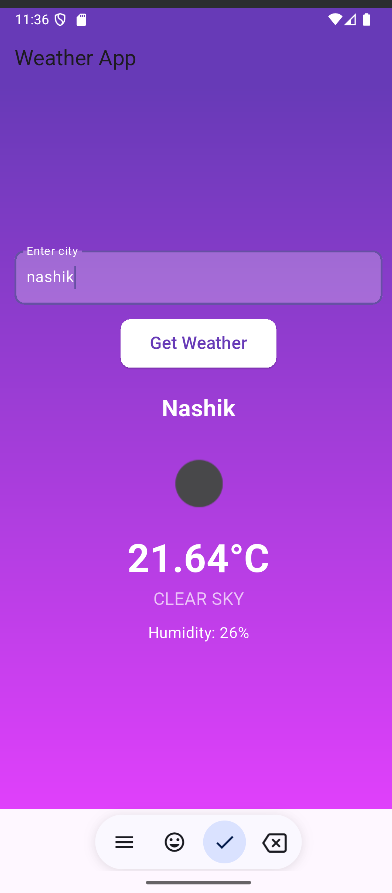

### **🌤 Weather App**  
A simple and modern **Flutter Weather App** that fetches real-time weather data using the OpenWeather API.

---

## **🚀 Features**
✅ **Real-time Weather Updates**: Get the latest weather details for any city.  
✅ **Modern UI**: Beautiful gradient background with smooth UI components.  
✅ **Weather Icons**: Displays corresponding weather condition icons.  
✅ **Error Handling**: Notifies users if there's an issue fetching data.  

---

## **🛠 Tech Stack**
- **Flutter** (Dart)  
- **OpenWeather API** (for weather data)  
- **HTTP package** (to make API calls)  
- **Flutter Dotenv** (to manage API keys)  

---

## **📦 Installation & Setup**
### **1️⃣ Clone the Repository**
```bash
git clone https://github.com/your-username/flutter-weather-app.git
cd flutter-weather-app
```

### **2️⃣ Install Dependencies**
```bash
flutter pub get
```

### **3️⃣ Set Up API Key**
- Create an account at **[OpenWeather](https://openweathermap.org/api)**
- Get your **API Key**
- Create a `.env` file in the root directory and add:
  ```env
  API_KEY=your_openweather_api_key
  ```

### **4️⃣ Run the App**
```bash
flutter run
```

---

## **📸 Screenshot**
 

---

## **📝 Project Structure**
```
📂 flutter-weather-app
 ┣ 📂 lib
 ┃ ┣ 📜 main.dart        # Main entry point of the app
 ┃ ┣ 📂 services
 ┃ ┃ ┣ 📜 weather_service.dart  # Fetches weather data from API
 ┃ ┣ 📂 assets
 ┃ ┃ ┣ 🌤 Weather icons (if added)
 ┣ 📜 .env.example       # Example environment variables file
 ┣ 📜 pubspec.yaml       # Flutter dependencies
 ┣ 📜 README.md          # Project documentation
```

---

## **🔗 API Reference**
- **Endpoint**: `https://api.openweathermap.org/data/2.5/weather`
- **Example Request**:
  ```
  https://api.openweathermap.org/data/2.5/weather?q=Mumbai&appid=YOUR_API_KEY&units=metric
  ```
- **Response Format (JSON)**:
  ```json
  {
    "name": "Mumbai",
    "main": { "temp": 28.5, "humidity": 65 },
    "weather": [{ "description": "clear sky", "icon": "01d" }]
  }
  ```

---

## **📜 License**
This project is **open-source** under the MIT License.  
